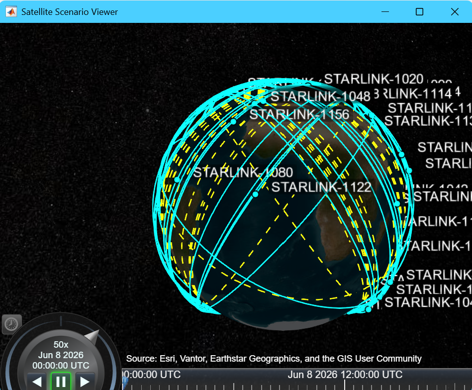
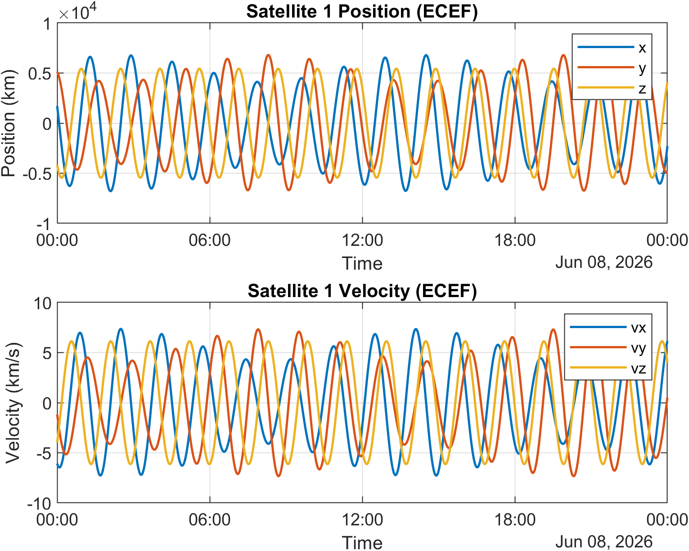
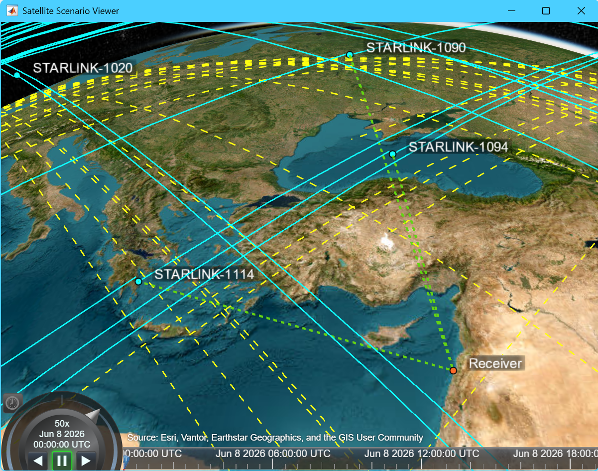
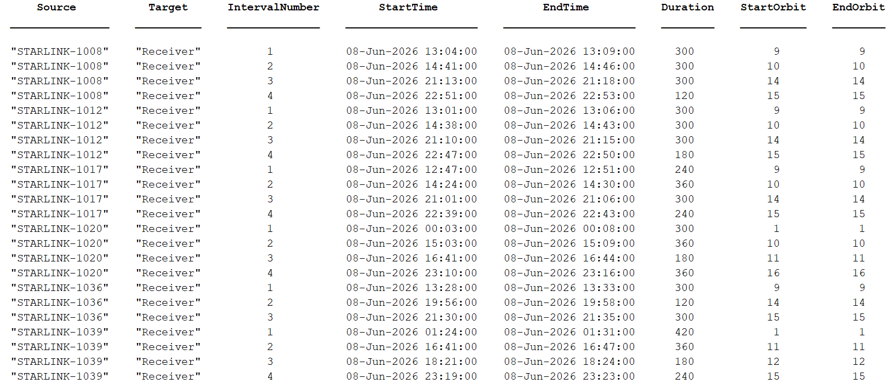
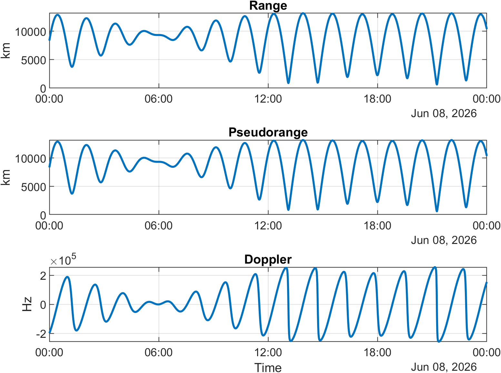

# StarlinkSim

MATLAB-based simulation of a Starlink Low Earth Orbit (LEO) constellation for satellite propagation, visibility analysis, and measurement generation.

## Overview

This project implements a simplified Starlink positioning simulation workflow consisting of three main tasks:

1. **Task A – Satellite Orbit Propagation**
2. **Task B – Receiver Visibility Analysis**
3. **Task C – Pseudorange and Doppler Measurement Generation**

The simulation uses publicly available Starlink TLE data and MATLAB's Aerospace Toolbox to propagate satellite orbits, determine visibility from a ground receiver, and generate navigation-related measurements.

---

## Repository Structure

```text
results/
├── taskA
│   ├── sat1_state.png
│   └── scenario_viewer.png
│
├── taskB
│   ├── satellite_intervals.csv
│   ├── satellite_intervals.png
│   └── scenario_viewer.png
│
└── taskC
    └── measurements_sat1.png
```

---

# Task A – Satellite Orbit Propagation

The first task focuses on propagating Starlink satellite orbits from TLE (Two-Line Element) data.

### Objectives

* Load Starlink TLE data
* Create a MATLAB `satelliteScenario`
* Propagate satellite trajectories over a 24-hour period
* Extract satellite position and velocity states in ECEF coordinates
* Visualize satellite ground tracks

### Scenario Visualization



### Satellite State Evolution

The figure below shows the ECEF position and velocity components of a representative satellite throughout the simulation period.



### Output

Task A produces:

* Satellite position vectors
* Satellite velocity vectors
* Time history of propagated states
* Orbit and ground-track visualizations

---

# Task B – Receiver Visibility Analysis

After propagating the constellation, a stationary ground receiver is placed in Beirut, Lebanon.

A minimum elevation mask of **10 degrees** is applied to determine which satellites are considered visible.

### Objectives

* Define a ground receiver
* Compute satellite access intervals
* Filter satellites using an elevation mask
* Determine visibility periods throughout the day

### Receiver and Visible Satellites

Green access links indicate satellites that satisfy the visibility constraints.



### Visibility Intervals

The following table summarizes all access intervals between visible satellites and the receiver.



### Output

Task B produces:

* Visible satellite subsets
* Access interval tables
* Visibility durations
* Satellite pass information

---

# Task C – Pseudorange and Doppler Measurements

The final task generates navigation measurements from the propagated satellite states.

The receiver position is converted from Latitude–Longitude–Altitude (LLA) coordinates to Earth-Centered Earth-Fixed (ECEF) coordinates. Using satellite and receiver states:

* Geometric range is computed
* Pseudorange measurements are generated
* Doppler measurements are computed from range rate

### Measurement Generation

For a satellite-receiver pair:

* **Range** = distance between satellite and receiver
* **Pseudorange** = simulated range measurement
* **Doppler** = rate of change of range

### Example Measurements

The figure below shows the generated measurements for a representative satellite.



### Output

Task C produces:

* Range measurements
* Pseudorange measurements
* Doppler measurements
* Time-series measurement plots

---

# Future Work

Potential extensions include:

* Position estimation using Least Squares
* Extended Kalman Filter (EKF) based navigation
* Multi-receiver simulations
* IMU integration
* Full Starlink constellation processing
* Measurement noise modeling

---

# Tools

* MATLAB
* Aerospace Toolbox
* Satellite Communications Toolbox
* Starlink TLE data

---

# Author

Maroun Eid
